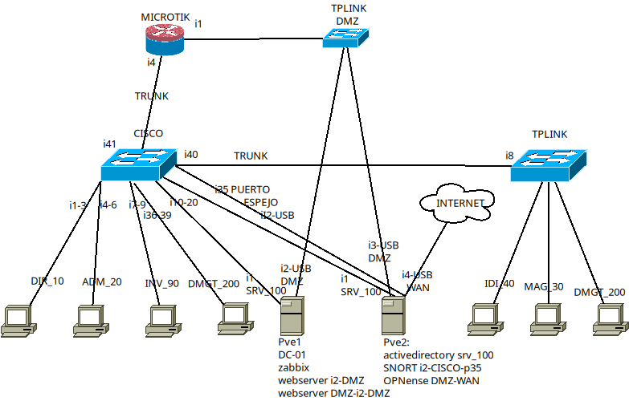
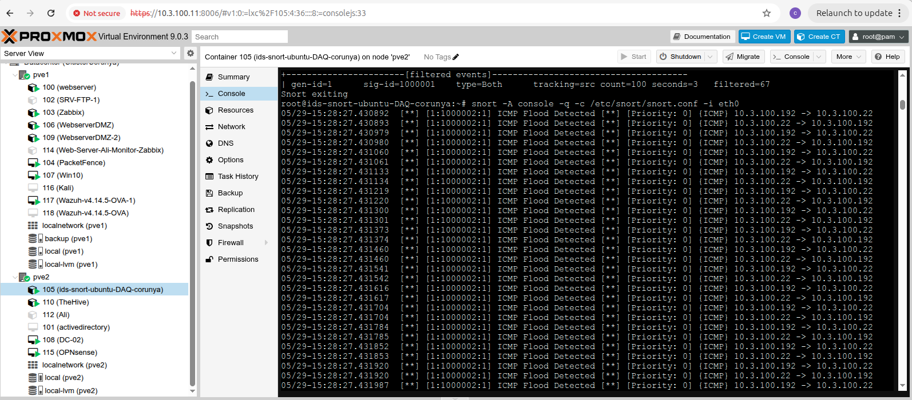
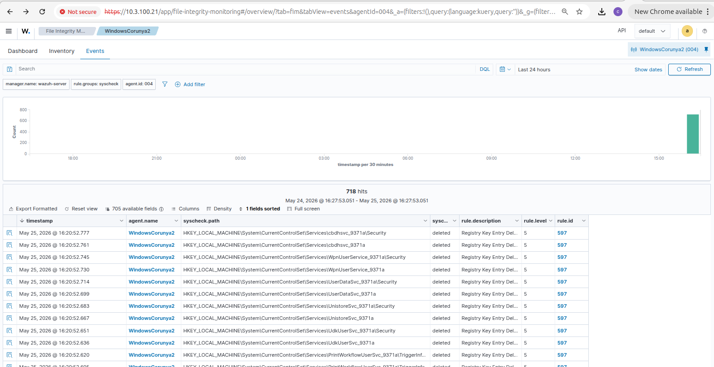
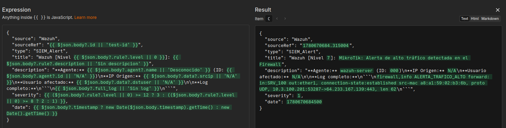
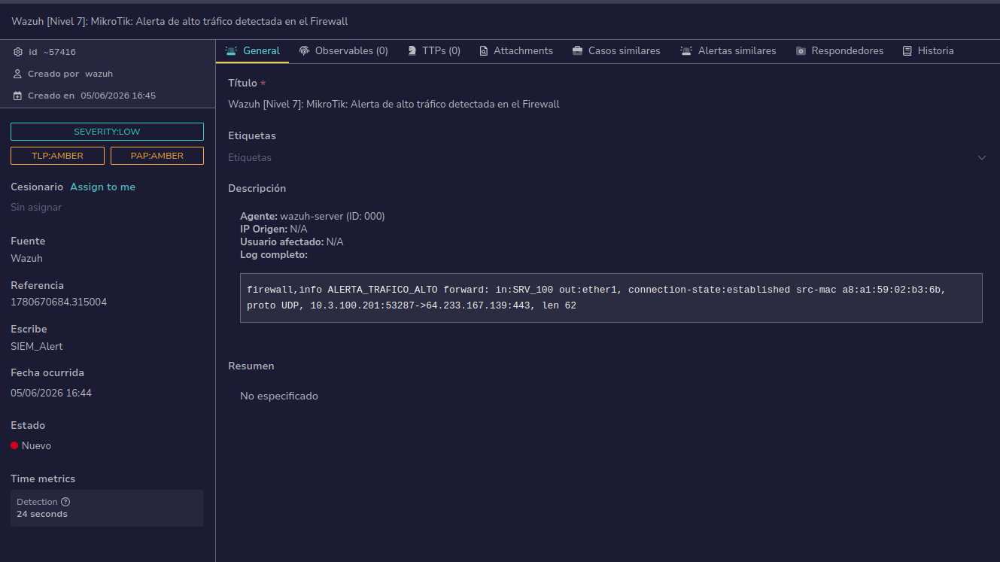

# Infraestructura Corporativa Segura y Flujo de Monitorización SOC

Este proyecto recoge el diseño, despliegue y bastionado de una red corporativa completa que simulamos durante el curso. El entorno cuenta con seguridad perimetral, segmentación por VLANs, gestión centralizada de usuarios con Active Directory, cortafuegos con detección de intrusiones y un flujo automatizado para registrar incidentes y avisar al equipo en tiempo real mediante Wazuh, n8n y TheHive.

> **Contexto:** Proyecto desarrollado en equipo (4 personas) durante el Curso de Especialización en Ciberseguridad en el CIP FP Batoi. El nombre «Corunya» fue el nombre en clave asignado a nuestro grupo para simular nuestra sede corporativa frente a las sedes de otros compañeros conectadas mediante túneles VPN.

---

## 1. Arquitectura y Topología de Red

El montaje simula la red de una empresa real, separando el tráfico por departamentos y aislando los servicios públicos en una zona desmilitarizada (DMZ).



### Zonas y Segmentación (VLANs)
* **Conexión exterior / WAN:** Router MikroTik conectado a Internet y túneles VPN WireGuard para comunicar nuestra sede con las demás.
* **DMZ (Servicios Web):** Servidores accesibles desde el exterior protegidos con proxy inverso y WAF ModSecurity.
* **Red interna (LAN):** Subredes aisladas mediante switches gestionados Cisco y TP-Link:
  * VLAN 10: Dirección (`DIR_10`)
  * VLAN 20: Administración (`ADM_20`)
  * VLAN 30: Almacenamiento (`MAG_30`)
  * VLAN 40: Informática e I+D (`IDI_40`)
  * VLAN 90: Invitados (`INV_90`)
  * VLAN 100: Servidores e infraestructura interna (`SRV_100`)
  * VLAN 200: Gestión y administración de red (`DMGT_200`)

---

## 2. Virtualización en Clúster (Proxmox VE)

Virtualizamos los servidores y servicios del entorno en dos equipos físicos configurados en clúster con Proxmox VE (`pve1` y `pve2`).



### Reparto de Máquinas y Servicios
* **Nodo 1 (`pve1`):**
  * Servidores web internos y almacenamiento de archivos.
  * Servidor Zabbix para monitorización de rendimiento mediante SNMP.
  * Servidores web en la DMZ.
  * Servidor PacketFence para control de acceso a la red (NAC).
  * Servidor central Wazuh (Manager, Indexer y Dashboard).
* **Nodo 2 (`pve2`):**
  * Cortafuegos OPNsense (enrutamiento, reglas de filtrado y NAT).
  * Controladores de dominio Active Directory (`DC-01` y `DC-02` en Windows Server).
  * Servidor TheHive para triaje y gestión de casos de incidentes.
  * Servidor n8n para flujos de automatización (SOAR).
  * Máquina con Snort IDS escuchando en puerto espejo.

---

## 3. Seguridad Perimetral y Control de Acceso

* **Cortafuegos perimetral (OPNsense):** Filtrado de tráfico entre zonas (WAN, LAN y DMZ) y prevención de intrusiones con Suricata.
* **Protección Web (WAF ModSecurity):** Reglas activadas en los servidores web de la DMZ para bloquear ataques habituales como inyecciones SQL o accesos no autorizados a carpetas.
* **Sensor de red (Snort IDS):** Switch Cisco configurado con puerto espejo (SPAN en el puerto 35) para enviar una copia de todo el tráfico de la red al sensor y detectar anomalías en tiempo real.
* **Control de usuarios y red:** Dominio con Active Directory para políticas de seguridad en equipos, autenticación de red con RADIUS y control de acceso con PacketFence (incluyendo portal cautivo para invitados).
* **Comunicaciones entre sedes:** Túneles seguros con WireGuard para conectar nuestra sede con las demás sedes del aula.

---

## 4. Flujo Automatizado de Monitorización SOC y Respuesta ante Incidentes

Montamos un flujo automatizado para que cualquier alerta importante se convierta en un caso de investigación sin intervención manual:

```text
  [Eventos en Equipos y Red] ──(Logs)──> [Wazuh SIEM]
                                              │
                                              │ (Alerta vía Webhook)
                                              ▼
                                         [Flujo en n8n]
                                              │
                    ┌─────────────────────────┴─────────────────────────┐
                    │ (Crear caso)                                      │ (Aviso urgente)
                    ▼                                                   ▼
         [TheHive - Casos SOC]                                [Canal de Telegram]
```

### Detección con Wazuh SIEM
* Agentes de Wazuh instalados en los servidores Linux y Windows.
* **Integridad de archivos (FIM) y VirusTotal:** Supervisión en tiempo real de cambios en carpetas críticas y en el registro de Windows. Conectamos la API de VirusTotal mediante API Key en Wazuh para que, cada vez que el módulo de integridad detecte un archivo nuevo o modificado, envíe automáticamente su hash para analizarlo y alerte si coincide con malware conocido.
* **Detección de rootkits y anomalías:** Comprobación periódica de binarios ocultos o cambios sospechosos en el sistema.
* **Conexión con Snort:** Centralizamos las alertas del IDS de red dentro de Wazuh para ver toda la actividad desde un único panel.



### Automatización con n8n y TheHive
* Cuando Wazuh detecta un evento relevante (nivel 3 o superior), un script en Python lo envía por HTTP POST al webhook de n8n.
* n8n formatea la información y llama a la API de TheHive para abrir un nuevo caso de incidente con los datos del ataque.
* Al mismo tiempo, si la alerta es crítica, n8n envía un mensaje automático a un canal privado de Telegram con el resumen del problema para avisar al analista de guardia.





---

## 5. Pruebas Realizadas y Verificación

Para comprobar que todo funcionaba correctamente, realizamos varias pruebas simulando ataques reales desde una máquina con Kali Linux:

1. **Ataque DoS (Inundación ICMP):** Lanzamos tráfico masivo y comprobamos que Snort lo detectó al instante a través del puerto espejo.
2. **Escaneo de red:** Al realizar un escaneo de puertos con Nmap, Snort generó la alerta correspondiente y Wazuh la recogió en el panel.
3. **Ataques web:** Probamos inyecciones SQL, intentos de path traversal y escaneos con Nikto contra la web de la DMZ; ModSecurity bloqueó las peticiones devolviendo un código 403 Forbidden.
4. **Prueba con malware (EICAR):** Descargamos el archivo de prueba EICAR en equipos Windows y Linux; Wazuh lo detectó de inmediato mediante la monitorización de integridad.
5. **Archivos ocultos:** Creamos archivos con nombres ocultos en rutas del sistema (`/usr/bin/`) y las tareas de auditoría de Wazuh los marcaron como sospechosos.
6. **Alerta de firewall:** Simulamos tráfico no autorizado en el router MikroTik y verificamos que en menos de medio minuto teníamos el caso abierto en TheHive y el aviso en Telegram.

---

## 6. Estructura del Repositorio

* `configs/`
  * `custom-n8n.py`: Script en Python para enviar las alertas de Wazuh a n8n.
  * `wazuh-ossec-integration.xml`: Configuración de la integración y reglas de integridad para Wazuh.
  * `snort-rules.rules`: Reglas personalizadas para detectar escaneos, DoS y accesos.
  * `modsecurity-waf.conf`: Configuración del cortafuegos de aplicaciones web.
  * `cisco-span-mirror.txt`: Comandos para configurar el puerto espejo en el switch Cisco.
* `diagrams/`
  * `network_topology.png`: Esquema de la red y las VLANs.
  * `proxmox_cluster_snort.png`: Captura del clúster Proxmox y la consola de Snort.
  * `wazuh_fim_dashboard.png`: Panel de eventos de Wazuh.
  * `n8n_soar_mapping.png`: Flujo de trabajo en n8n.
  * `thehive_incident_alert.png`: Caso abierto en la interfaz de TheHive.

---

## 7. Resumen de Herramientas

| Área | Herramientas |
| :--- | :--- |
| Monitorización y Logs | Wazuh, Zabbix, Syslog |
| Análisis de Malware | VirusTotal API |
| Gestión de Incidentes | TheHive, n8n, Telegram Bot |
| Red y Perímetro | OPNsense, MikroTik, Cisco, TP-Link |
| IDS y WAF | Snort IDS, Suricata, ModSecurity |
| Usuarios y Acceso | Active Directory, RADIUS, PacketFence |
| Virtualización y VPN | Proxmox VE, WireGuard |
